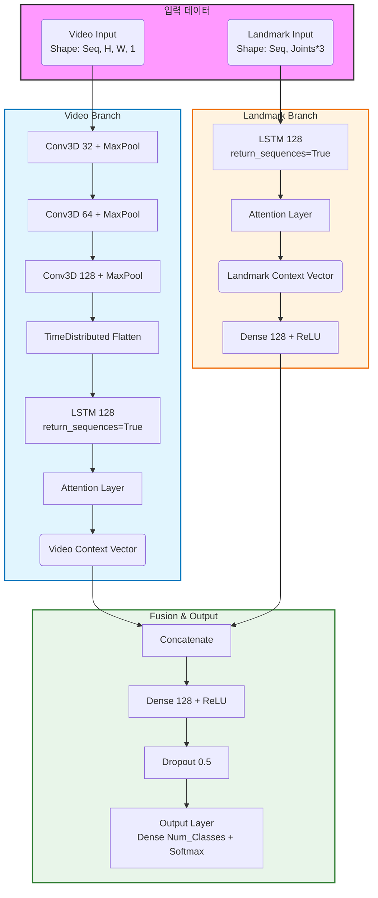

# HandPose Recognition (1인칭 실시간 손동작 인식)

이 프로젝트는 **1인칭 시점 손동작 영상**과 **MediaPipe 손 랜드마크**를 함께 활용하여  
**3D CNN (영상 기반) + LSTM (랜드마크 기반) + Attention 융합 모델**을 학습하고,  
실시간으로 손동작을 인식하는 프레임워크입니다.

---

## 🏗️ 모델 아키텍처 (Model Architecture)

이 모델은 영상 프레임(Video)과 손 좌표(Landmark) 데이터를 결합하여 추론하는 멀티모달 구조를 가집니다.



Video Branch: 3D CNN을 통해 영상의 시공간적 특징을 추출하고, LSTM과 Attention을 통해 중요한 프레임 정보를 요약합니다.

Landmark Branch: MediaPipe로 추출된 손 관절 좌표의 시계열 변화를 LSTM과 Attention으로 분석합니다.

Fusion: 두 가지 정보를 결합(Concatenate)하여 최종 제스처를 분류합니다.

📂 프로젝트 구조
```

handpose-recognition/
│── README.md               # 프로젝트 설명 및 모델 구조
│── requirements.txt        # 필요한 라이브러리 목록
│── config.py               # 공통 설정 (Sequence Length, Image Size 등)
│
├── data/                   # 데이터 저장 폴더
│   └── raw/                # 원본 영상 데이터 (클래스별 폴더)
│
├── dataset/
│   └── data_loader.py      # 데이터 로딩 & 전처리 (Generator)
│
├── models/
│   ├── attention_layer.py  # Custom Attention 레이어 정의
│   ├── multimodal_model.py # (3D CNN + LSTM + Attention) 융합 모델
│   └── multimodal_model_3d.py # (구버전/대체 모델 등)
│
├── utils/
│   ├── mediapipe_utils.py  # MediaPipe 헬퍼 함수 (랜드마크 추출)
│   ├── visualization.py    # 시각화 함수 (학습곡선, 혼동행렬)
│
├── train.py                # 모델 학습 스크립트
├── evaluate.py             # 모델 평가 (리포트 & confusion matrix 저장)
└── inference.py            # 실시간 웹캠 추론 스크립트
```
